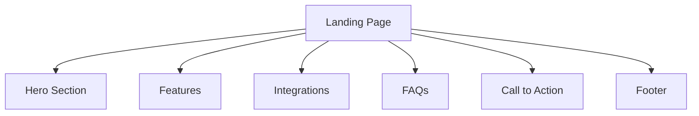

<h1 align="center">Layers Editor Landing Page 🎨 </h1>
<p align="center">
  
</p>
<p align="center">
  
  
  
</p>

---

A **modern, responsive SaaS landing page** built for **UI Editing MVPs** ✨.
Designed, developed, and sold animated UI components for developers. Perfect for startups and SaaS products 🚀.

---

## ✨ Features

* ⚡ **Next.js** + **TypeScript** for high performance and type safety
* 🎨 **Tailwind CSS** for rapid styling
* 🧩 Modular, reusable **React components**
* 📱 Fully responsive for all devices
* 📦 Pre-built sections: Hero, Features, Integrations, FAQs, Call to Action, Footer, and more
* 🛠 Easy customization for content and assets

---

## 🗂 Folder Structure

```plaintext
src/
  app/                # Main app entry, global styles, layout, and pages
  assets/images/      # Image assets and logos
  components/         # Reusable UI components (Button, Avatar, FeatureCard, etc.)
  sections/           # Page sections (Hero, Features, Integrations, etc.)
```

---

## ⚙️ Installation

```bash
git clone https://github.com/MuhammadTanveerAbbas/Layers-Editor-Landing-Page.git
cd Layers-Editor-Landing-Page
npm install
# or
yarn install
```

---

## 🚀 Usage

```bash
npm run dev
# or
yarn dev
```

Open [http://localhost:3000](http://localhost:3000) to view it in your browser.

---

## 🖼 Diagram



---

## 🎯 Customization

* 🖼 Update images in `src/assets/images/`
* ✏️ Edit content in `src/sections/`
* 🎨 Change styles in `src/app/globals.css`
* ⚡ Modify Tailwind settings in `tailwind.config.ts`

---

## 🤝 Contributing

1. 🍴 Fork the repository
2. 🌱 Create a new branch
3. 💡 Commit your changes
4. 📤 Push to your branch
5. 🔄 Open a Pull Request

---

## 📜 License

Licensed under the [MIT License](LICENSE).

---

